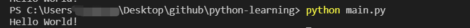
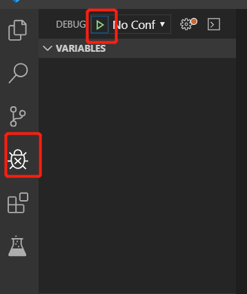
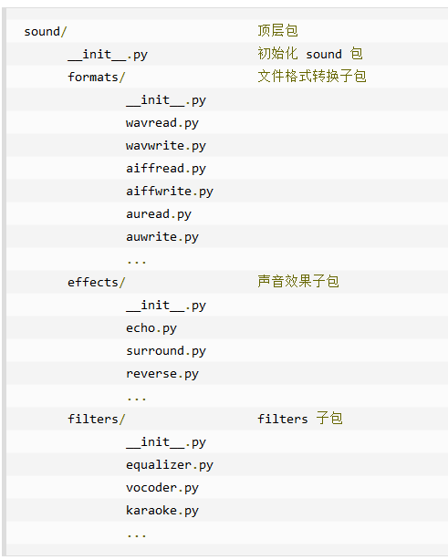

## 2.	Hello World！

学习一门编程语言，首先要从基础语法入手，懂得了编程规则加以组装就能够实现我们想要的功能了。对于小白来说，很难记住全部的语法和方法。我们可以先去了解基本的功能，也就是我们都能做什么。再反复的实践过程中，我们不断地回溯这些语法和方法，就能够牢牢地记住他们了。可以想象成我们要造一辆车，我们要先知道车有几部分组成。只要把我们能这几部分成功的拼在一起就好了。至于轮子怎么做，方向盘怎么做，我们可以返来查找资料，或者利用开源的程序。我个人认为，对于初学者，造车的关键是怎么拼装，而不是从造螺丝有几圈螺纹开始。

### 2.1. Python 初体验 Hello World！ 
我们首先来尝试一个python脚本，在文件main.py上输入代码
```
print('Hello World!')

```
注意程序最后一行为空白行，否则会会提示编译警告。
在terminal中输入```python main.py``` 回车，则开始运行主程序。
 
  </img>

可以看到下面一行，打印出Hello World! 
Congratulation!我们已经成功运行了第一个Python程序。
同样，我们也可以利用debug模式运行程序，以方便我们设置断点进行调试（debug模式的使用将在后面章节详细说明）
点击左侧瓢虫图标或者 ```Ctrl + Shift + D``` 打开Debug控制台。点击**Start Debugging** 绿色三角按钮开始启动程序。

  </img>

 同样在经过编译后 terminal中会打印 ```Hello World!``` 字样。
### 2.2. Python 语法
#### 2.2.1. Python 基础语法要点
1. 标识符
    + 以下划线开头 如 ```_function```，不能直接访问，不能 ```from xxx import _function```导入，需要通过接口访问
    + 以双下划线开头和结尾 如 ```__init__()```为特殊方法专用
    + 保留字符 - 不能作为变量或者常数使用，运行以下代码查看
      ```
      import keyword
      print(keyword.kwlist)

      ```
2. 缩进和空格

    Python是缩进式区分模块的语言，类似于Dart语言。优点是我们可以很清晰的看出每块代码的结构，缺点是不容易找出缩进引起的错误。
  VS Code 可以自动检测每块代码，可以通过点击序列前的箭头按钮来收起和展开一块代码 

    </img>

    Python 对空格的要求十分严格，空格和TAB不能混用，若混用编译后会报错```IndentationError: unindent does not match any outer indentation level```, 统一每一行前的空格为一种形式即可，VS Code中一般4个空格，或2个TAB 视为一次缩进。由于默认代码检查插件的缘故，即时修改VS Code设置，不以2TAB缩进，也会出现警告提示。

3. 符号，输入，输出
    + \# - 用于注释代码，暨解释说明，无意义 ```# This is my first python app! ``` 
    + ' 或 " - 标识字符串内容，暨引号内内容为一段文字 ```pie = 'A normal pie'```
    + ''' 或 """ - 用于多行注释 
      ```
      ''' 
      this is the first line
      this is the second line
      '''
      ```
      同时 ''' 也可以标识多行字符串的内容，
      ```
      print(
        '''Hello
        World!'''
      )
      ```
      运行可看到terminal中打印
      ```
      Hello
      World!
      ```
    + input - 用户输入
      ```
      myInput = input("按下 enter 键退出，其他任意内容显示\n")
      print(myInput)
      ```
      暨定义一个变量```myInput```等于我们要输入的值，再把刚刚输入的值打印出来。```\n```代表换行。
    + print - 打印 在print中加入参数```end```为空字符，暨两次print不换行
      ```
      print('May I have ', end='')
      print('a cup of tea, ', end='')
      print('please!')

      ```
      暨打印出
      ```
      May I have a cup of tea, please!
      ```

      格式化字符串 **format()** 使我们可以定义好一个模板，只要把对应的空填上就可以得到我们需要的字符串了。我们可以靠 **{}** 来确定变量的位置。
      ```
      lunch = 'Lunch list: {}, {} and {drink}。'
      mainCourse = 'LambSteek'
      salad = 'Tomato'
      wine = 'Lafite'
      print(lunch.format(mainCourse, salad, drink=wine))
      ```

    + : - 代码组的一部分，标识下面缩进内容属于该方法
      ```
      me = 'hungry'
      if me == 'hungry':
          print('Eat a pie!')
      ```
      print的内容属于```if```这个块内的代码，只有当```me```等于```'hungry'```时触发。
#### 2.2.2. Python 浅尝
1. import 和 from import  
  我们在写代码的过程中，有时候需要用到多种类型的文件和脚本。我们不可能把全部内容放到同一个文件中。想要调用其他文件中内容，我们可以运用```import``` 和 ```from xxx import xxx```

    + import A  - 导入整个模块A
    + from B import A - 导入 B 模块中的 A 方法
    + from B import A, C, D - 导入 B 模块中 A, C, D 三个方法
    ```
    from sys import argv
    print(argv)
    ```
    ```
    import sys
    print(sys.argv)
    ```
    两个例子效果相同，此处我们引用了系统模块中的一个方法叫argv（argv可以理解为python脚本的输入参数列表）。一个模块下可能会出现很多函数方法的情况，我们可以使用```dir(模块名)```的方法来查看，这个文件下所有方法的名。  
    我们也可以自己定义一个包，作为被引用模块的文件夹。一个包中可以包括过多个子包，每个包中都需要定义一个__init__.py文件来做初始化。每个最小的包下可以包括多个模块文件。每个模块文件可以包括多个方法。我们会在后续的实例中看到很多这样的用法。

    


2. 变量和赋值  
    + 变量 - 可以变化的量，除保留字符外任意命名。对大小写敏感暨区分大小写。一般遵守驼峰式命名。如```myPhone、applePie、 johnSmith```
    + = - 赋值暨等号右侧的值赋给左侧变量
    ```
    dinner = 'chicken fried rice'
    # dinner变量是一个叫 chicken fried rice的字符串

    breakfast = lunch = dinner = 'banana'
    # 变量breakfast和lunch和dinner 都等于 字符串 apple
    
    breakfast, lunch, dinner = 'pizza', 'double cheese hamburger', 'big mac'
    # 变量breakfast等于pizza，lunch等于double cheese hamburger，dinner等于big mac
    ```
3. 标准数据类型  
    + Number（数字）包括 int(整数)、float(小数)、bool(True或False)、complex(复数)四种类型
      ```
      num = 4+3j
      print(type(num))
      # 打印num的类型

      print(isinstance(num, complex))
      # 打印判断num是不是complex类型的结果
      # type()不会认为子类是一种父类类型
      # isinstance()会认为子类是一种父类类型（父子类的概念在后面章节会讲解）
      ```
      得到
      ```
      <class 'complex'>
      True
      ```
      True的值为1，False的值为0，在python中True/False可以直接与数字进行运算

    + String（字符串）
      可以理解为一段文字，用 **'** 或 **"** 包裹。  
      运算符：

      符号 |  描述  
        -|-
        \+ | 拼接
        \* | 复制
        \ | 转义

      ```
      print(('\nHello' + '\n' + 'World!') * 2)
      ```
      得到
      ```
      
      Hello
      World!
      Hello
      World!
      ```

      如果不想转义 在字符串前加 **r** 即可

      ```
      print('first line\n second line')
      #\n 为换行符号
      
      print(r'first line\n second line')
      # \n 为字符串
      ```
      得到
      ```
      first line
       second line
      first line\n second line
      ```
      截取字符串：python中的位置索引是从0开始的，一个字符串的首字母暨在第0位上，截取写法例如：
      ```
      index = 'abcdefg'
      print(index[0:-1])    #  第一个到倒数第二个个字符 abcdef
      print(index[0])       #  第一个字符 a
      print(index[2:5])     #  第三个到第五个的字符 cde
      print(index[2:])      #  第三个后所有字符 cdefg
      ```
      Python中字符串不能被改变，因此```word[0] = 'm'```这种写法是错误的，可以对变量重新赋值来进行更改。   

      常用方法：
      方法 |  描述  
        -|-
        .upper() | 全部大写
        .lower() | 全部小写
        .capitalize() | 首字符大写 ```print('chicken fried rice'.capitalize()) ``` 得到 ```Chicken fried rice ```
        .title() | 每个单词首字母大写```print('chicken fried rice'.title()) ```得到 ```Chicken Fried Rice ```


    + List（列表）
      顾名思义，一维列表可以想象成一行数据的有序集合，用 **[]** 包裹，如```list = [abc, 123, 'abc', True]```。列表中每个元素可以是任意类型数据，且有位置索引（从0开始）。```list[0]```标识list中第一位的元素，是一个叫```abc```的变量。同理```list[2]```是一个字符串，它的值是```abc```。  
      由于列表中可以嵌套列表，因此列表可以是多维的，如```list = [[1, 2, 3], [4, 5, 6], [7, 8, 9]]```表示的是一个二维列表

        ||||
        -|-|-
        1|2|3
        4|5|6
        7|8|9

      那么```list[1][1]```就是```5```。同样列表也可以用```+``` 和```*```进行运算，原理和字符串相似，结果是一个较高维度的新数组
      ```
      list = [1, 1, 1]
      list2 = [[2.1, 2.1, 2.1], [2.2, 2.2, 2.2]]
      print(list + list2)
      # 得到 [1, 1, 1, [2.1, 2.1, 2.1], [2.2, 2.2, 2.2]]
      ```
      列表的截取方式和字符串相同，不同的是，列表中元素可以被替换，如:
      ```
      list = ['Tim', 'Will', 'Lee']
      list[1] = 'John'
      print(list)

      #得到:['Tim', 'John', 'Lee']
      ```
      列表作为最常用的数据结构性质比较特殊。因为列表是可以被修改的，所以Python本身提供了许多对数组操作的方法

        |方法|描述|
        -|-|-
        .append(X)|尾部添加X
        A.extend(B)| A列表扩充B列表内容
        .insert(i, X) | 在第i位添加X
        .remove(X) | 删除位X的第一个元素
        .pop(i) | 移除第i位元素，不填则移除最后一位。并返回被移除的元素
        .clear() | 清空列表
        .index(X) | X的位置
        .count(X) | X出现的次数
        [.sort()](https://www.runoob.com/python/att-list-sort.html) | 排序
        .reverse() | 倒过来
        .copy() | 浅复制

        ```
        #  浅复制的只观结果
        list = [1, 2, 3, 4]
        b = list.copy()
        c = list
        list.append(5)
        print(b)     #   [1, 2, 3, 4] 
        print(c)     #   [1, 2, 3, 4, 5]
        ```
        + 为了节省空间，变量和变量值是对应关系的。同一值的的不同变量可能对应同一个变量值。这个变量值存储的地方会有一个地址。我们可以想象为 在调用 **list** 时，**list**根据他的地址去找到存储器中的值**[1, 2, 3, 4]** 。**c** 等于 **list**，只是他们两个都共用一个地址去取值。复制可以理解为复制出来一份值放在一个新地址上，**b** 调用的是新地址上的数据。因此list发生变化，b不会受影响。   

    + Tuple（元组）
      与列表类似，区别是元组中的元素不可修改，用 **()** 包裹
    + Set（集合）  
      集合（set）是由一个或数个形态各异的大小整体组成的，构成集合的事物或对象称作元素。用 **{}** 包裹。注意，在创建空集合是需要使用 ```set()```, 而不是 ```{}```。与数学上的集合相似，集合中元素是无序且会自动去重，其运算方式也是符合数学逻辑的。
      ```
      ageSet = {28, 26, 28, 27, 32, 33, 26}
      print(ageSet)

      # 得到 {32, 33, 26, 27, 28}
      ```
      运算符：

      符号 |  描述  
        -|-
        \- | 差集
        \| | 并集
        & | 交际
        ^ | 非交集

      ```
      ageSet1 = {28, 26, 28, 27, 32, 33, 26}
      ageSet2 = {25, 26, 24, 30, 33, 29, 28}
      print(ageSet1 - ageSet2)   # {32, 27}
      print(ageSet1 | ageSet2)   # {32, 33, 24, 25, 26, 27, 28, 29, 30}
      print(ageSet1 & ageSet2)   # {33, 26, 28}
      print(ageSet1 ^ ageSet2)   # {32, 24, 25, 27, 29, 30}
      ```
    + Dictionary（字典）   
      字典可以想象成是一种key-value形式的无序集合，用 **{}** 包裹，也可以用```dict()````定义。和现实中的字典相似，要找到一个字(value)，首先我们要知道一个拼音或者偏旁部首(key)。在一个字典中key值是唯一的，因此通过一个key就必定能找到一个value，即使是空值。
      ```
      foodMenu = {
          'appetiser': ['salad', 'bread', 'butter'],
          'mainCourse': ['lambShank'],
          'desert': 'teaCake'
          }
      print(foodMenu['mainCourse'])  #  ['lambShank']
      print(foodMenu.values())  #  dict_values([['salad', 'bread', 'oliver'], ['lambShank'], 'teaCake'])
      ```
      和列表相似，字典也可以进行嵌套。为字典增加一个新key可以直接写为```foodMenu['drink'] = 'houseAle'```。同时字典具备 clear(), keys(), values()这样的内置函数。  

      直接移除字典中key的方式有一下两种：

        符号 |  例子
        -|-
        del | ```del menu['drink']```, key 不存在，会报错 
        .pop() | ```menu.pop('drink')```, key 不存在，不会报错 


4. 数据转换  
    参考[菜鸟教程](https://www.runoob.com/python3/python3-data-type.html)   
    常用方法：

    |||
    -|-
    int(x, base=y) 或 int(x) | 转换成整数。```base=y``` 为该数字为y进制 base有值时 x必须为字符串；base无值时 x 为数字。因此要把16进制的18.2转换成10进制整数```int(str(int(18.2)), base=16)```
    float(x) | 转换成小数
    str(x) | 转换成字符串
    repr(x) | 转换对象成字符串
    eval(x) | 转换字符串成对象

5. 运算符号
  + 运算符

    |符号 |  描述|  
    |---------|---------|
    |\+ | 加|
    |\- | 减|
    |\* | 乘|
    |/ | 除|
    |// | 除，取整, 不四舍五入，除小数后返回**整数.0**如```100//11.1 = 9.0```|
    |% | 取余数|
    |** | 乘方|
    |& | 且 (二进制)|
    |\| | 或 (二进制)|
    |^ | 按位异或 (二进制)|
    |~ | 按位取反 (二进制)|
    |<< | 按位左移 (二进制)|
    |\>> | 按位右移 (二进制)|

  + 比较符

      符号 |  描述  
      |---------|---------|
      == | 等于
      != | 不等于
      \> | 大于
      < | 小于
      <= | 小于等于
      \>= | 大于等于

  + 赋值运算符

    符号 |  描述  
    |---------|---------|
    = | 赋值
    += | ```a += b``` 相当于 ```a = a + b```
    -= | ```a -= b``` 相当于 ```a = a - b```
    *= | ```a *= b``` 相当于 ```a = a * b```
    /= | ```a /= b``` 相当于 ```a = a / b```
    %= | ```a %= b``` 相当于 ```a = a % b```
    **= | ```a **= b``` 相当于 ```a = a ** b```
    //= | ```a //= b``` 相当于 ```a = a // b```

  + 逻辑运算符

    符号 |  描述  
    |---------|---------|
    and | 与
    or | 或
    not | 非

  + 身份运算符

      符号 |  描述  
      |---------|---------|
      is | 同内存地址
      is not | 不同内存地址

      ```
      john = 'man'
      tim = 'woman'[2:]
      print(john is tim)        #  False

      will = 'man'
      print(john is will)       #  True
      ```
  + 身份运算符   
  
      |符号 |描述|  
      |---------|---------|
      |in | 非|
      |not in | 非|

      ```
      john = 'man'
      ada = 'woman'
      print(john in ada)         #  True

      gender = ['man', 'woman', 'LGBT', 'cant tell']
      print(john in gender)      #  True
      ```
#### 2.2.3. Python 基础语句
1. 判断  
    ```
    if Condition 1:       #  如果满足条件1，执行1
      Execution 1
    elif Condition 2:     #  如果不满足条件1，但满足条件2，执行2
      Execution 2
    else:                 #  如果都不满足，执行条件3
      Execution 3
    ```
    if 可单独使用， else 如果不需要执行任何东西，可省略。  
    + 条件可以用运算符连接，如：> , < , == 等。
    + 多个条件可以用逻辑运算符连接， 如：and， or， not 等   
    
    
    假设我们需要做一个图书查找的工具。我们来假定一下输入和输出的场景：输入一本书名，查查看这本书是否在我们的图书列表中。  
    + 我们要定义一个列表来存放我们已记录的书名，如：《权力的游戏》《饥饿游戏》《哈利波特》。那么我们在不适用数据库的情况下需要一个定义列表来存放这些字符串
    + 我们需要用户手动输入书名，那么我们就要定义一个字符串变量来存放输入值
    + 输入值可能有三种情况：1. 空值， 2. 匹配到书名， 3. 没有匹配到书名
    + 为了更好的匹配，我们统一把输入书名和已存在的书名都变成大写字母   
    
    分析出了情况，利用判断语句，我们很快就能设计出一个建议的图书查找工具

    ```
    #  简易图书查找 v0.1

    bookName = input('请输入要查找的书名！\n')
    bookList = ['GAME OF THRONES', 'THE HUNGER GAMES', 'HARRY POTTER']
    if not bookName:
        print('Please inster a book name')
    elif bookName.upper() in bookList:
        print('You found ' + bookName.upper())
    else:
        print('No this book')

    # not bookName 表示当bookName为空时 为 True
    ```

2. 循环  
    利用循环可以帮助我们批量处理数据，尤其是对未知个数的情况经行遍历
    + while
      ```
      while Condition:
        Execution 1
      else:
        Execution 2
      ```
      while 表示 **知道不为。。。为止**，可以单独使用，当条件一直为True的时候，无限循环下去。
      else 为不满足 while条件执行，且只会在循环后执行一次。   

      回看一下我们之前的图书查找工具，我们不难发现，单纯的利用判断语句，只能适用有限次数的查找。查找完成后每次都要重启程序。利用while-else循环我们可以设计出一个无限次查找的工具，直到用户选择退出   
      + 我们需要直到用户输入特定条件才结束程序，那么while的条件就是当输入值不是exit，循环继续
      + 当输入exit我们返回结果，程序自动结束
      + 任何情况返回结果后，我们都希望让客户继续输入
      + 首次循环我们需要一个书名作为判断条件，因此，有一次输入需要放在循环之前  

      在确定了循环的框架和判断细节后，我们只需要把这两部分拼装嵌套在一起就可以了。

      ```
      #  简易图书查找 v0.2

      bookList = ['GAME OF THRONES', 'THE HUNGER GAMES', 'HARRY POTTER']
      bookName = input('请输入要查找的书名！\n')
      while bookName.lower() != 'exit':
          if bookName.upper() in bookList:
              print('You found ' + bookName.upper())
          elif bookName:
              print('No this book')
          bookName = input('请输入要查找的书名！\n')
      else:
          print('Exited')

      # bookName 有不等于exit或Exit或EXIT等变形体时循环，每次循环末尾让用户再次输入，以便下次循环使用。
      # 等于exit变形体则循环结束，打印Exited
      ```

    + for
      ```
      for Condition:
        Execution 1
      else:
        Execution 2
      ```
      for 可以单独使用，当条件一直为True的时候，无限循环下去。else 为不满足 for 条件执行，且只会在循环后执行一次。for和while在逻辑上基本没有区别。由于条件的不同，for一般用于有限循环，while一般用于无限或不知道是不是无限的循环使用。

      回看我们的图书查找工具，我们可能希望限制不同身份用户的查找次数，那么我们可以利用for循环来轻松解决，有限的判断

      ```
      #  简易图书查找 v0.3
      roleList = {'title': ['admin', 'user'], 'auth': [5, 3]}
      bookList = ['GAME OF THRONES', 'THE HUNGER GAMES', 'HARRY POTTER']
      roleName = input('请输入权限代码！\n')
      times = 0
      counter = 0
      for i in range(0, roleList['title'].__len__()):
          #  .__len__()为求列表长度的方法，也可以用len(roleList['title'])代替
          # i in range(0, 10) 暨 i为从0到10的数字，i每次循环默认加1 知道大于10，循环结束
          if roleName == roleList['title'][i]:
              times = roleList['auth'][i]
          else:
              counter += 1
      else:
          if counter == roleList['title'].__len__():
              print('无权限访问！')
          else:
              bookName = input('请输入要查找的书名！\n')
              searchCounter = 1
              while bookName.lower() != 'exit' and searchCounter < times:
                  if bookName.upper() in bookList:
                      print('You found ' + bookName.upper())
                  elif bookName:
                      print('No this book')
                  bookName = input('请输入要查找的书名！\n')
                  searchCounter += 1
              else:
                  print('Exited')

      ```

      这个例子是一种复杂冗余的写法，其目的是为了展示循环判断之间的嵌套连接。为了代码的可读性和性能的提升，一个循环即可解决以上问题。  
    + break 和 continue
    暨 中断 和 继续。 
      ```
      flag = True
      counter1 = 0
      counter2 = 0
      while (flag):
          counter1 += 1
          if counter1 % 10 == 0:
              continue
          counter2 += 1
          if counter1 == 101:
              break
      print(counter1)
      print(counter2)
      ```
      不难看出，例子中 **while** 本来是一个无限循环，每次循环 **counter1** 和 **counter2** 本来都会加一，但是由于 **counter1** 为10的倍数是，**continue** 使程序直接跳到下一次循环，**counter2** 在本次循环中没有加一。所以每十次循环 **counter2** 就要比 **counter1** 少加一次一。此外当 **counter1** 增长到101时循环被 **break** 强制终端，打印出结果 ```101``` 和 ```91```
3. 函数
  函数的性质和数学中函数类似，f(x) = x + 1 那么 f(2) 就等于 3。所以函数可以理解成一个计算公式或者一种方法。当我们使用这种方法时会得到结果或者触发事件。
  + def 和 return
    def - define 定义一个函数， def + 函数名 + ( + 参数 + ): + 函数内容。```def myFunction():```， 可以不加参数。   
    return - 返回一个值，return + 一个值。 无值时，表示退出这个函数。
  + 传参
    ```
    def checkBill(fee, tax, tips):
        print(fee + tax + tips)


    checkBill(200, 20, 10)   # 必须传参 - 输入的参数顺序，个数 与定义中一致
    checkBill(tax=20, fee=200, tips=10)   #关键字传参 - 顺序可不一致，个数必须一致
    ```
  有的时候我们希望在多数情况下某个参数具有默认值，只有传了这个参数，参数值才会改变。那么只要在接收方也就是函数中设置就可以了

    ```
    def checkBill(fee, tax, tips=15):
        print(fee + tax + tips)


    checkBill(tax=20, fee=200)   #235
    checkBill(200, 20, 10)       #230
    ```
  有事我们可能不确定要传几个参数，我们可以用*或者**来定义参数，参数会以元组或字典的形式被传入。

    ```
    tax = 20


    def checkBill(fee, *tips):
        sumTips = 0
        for item in tips:
            sumTips += item
        print(fee + tax + sumTips)


    def checkBill2(*tips, fee):
        sumTips = 0
        for item in tips:
            sumTips += item
        print(fee + tax + sumTips)


    john = 2
    tim = 3
    ada = 2
    checkBill(200, john, tim, ada)
    checkBill2(john, tim, ada, fee=200)
    ```

    函数中可以调用已经定义过的变量 **tax**， 也可以在被定义之后随意调用

  + 匿名函数lambda  
    匿名函数只能写在一行内，且最多支持三元表达(条件? True的执行 : False的执行 ```print('Excellent' if score > 90 else 'Still Good') ```)。可以接受传参，但不能调用它函数以外的参数。匿名函数在新的语法中不建议使用，有可能会出现警告提示。
    ```
    tax = 20


    def checkBill(fee, *tips):
        sum = lambda item, total: total + item
        sumTips = 0
        for item in tips:
            sumTips = sum(item, sumTips)
        print(fee + tax + sumTips)


    checkBill(200, 2, 3, 2)
    ```
  
  掌握了函数的基本用法，我们来回溯一下图书查询工具。利用函数，我们按功能把代码放在一个个函数中，进行分割，需要的时候再去执行这个功能。我们可以把之前的查询功能放在一个函数中，再定义一个添加图书的功能。

  ```
  #  简易图书查找 v0.4
  bookList = ['GAME OF THRONES', 'THE HUNGER GAMES', 'HARRY POTTER']


  def showMenu():
      print('''
          Please enter following number to choose functions:
          1. Search a book
          2. Add a book to the list
          3. Exit
      ''')
      index = input('请输入\n')
      checkIndex(index)


  def checkIndex(index):
      if index == '1':
          searchByName()
      elif index == '2':
          addBook()
      elif index == '3':
          return
      else:
          showMenu()


  def searchByName():
      bookName = input('请输入要查找的书名！(输入exit返回上一级)\n')
      while bookName.lower() != 'exit':
          if bookName.upper() in bookList:
              print('You found ' + bookName.upper())
          elif bookName:
              print('No this book')
          bookName = input('请输入要查找的书名！(输入exit返回上一级)\n')
      else:
          print('Exited')
          showMenu()


  def addBook():
      bookName = flag = input('请输入要添加的书名！(批量添加用逗号隔开, 输入exit返回上一级)\n')
      if flag.lower() != 'exit':
          books = bookName.split(',')
          nameString = ''
          for item in books:
              nameString += '《' + item + '》'
          flag = input('您要添加的是' + nameString.upper() + '对吗？ Y/N (输入exit返回上一级)\n')
          if flag.lower() == 'y':
              add(books)
              sum = lambda alist: len(alist)
              print('You have ' + str(sum(bookList)) + ' books in the list!')
              addBook()
          elif flag.lower() == 'exit':
              showMenu()
          else:
              addBook()
      else:
          showMenu()


  def add(books):
      for book in books:
          bookList.append(book)


  showMenu()

  ```
  为了更好的体现我们所学习到的知识，这段代码使用了很多不必要的循环和函数。我们可以看出，程序是由**showMenu** 这个函数发起的。**checkIndex** 起着导航的作用，类似于 C语言中 **switch** 方法。我们可以看出，通过对函数自身的调用，也可以创造循环。在自调用中**if。。。else** 可以起到和 **continue**、**break** 一样的作用。我们可以通过更多系统函数和判断条件来完善以上的代码，修复bug。这需要我们不断的进行测试和调试。

  
4. 数据结构
  + 推导式
    对列表操作时我们可以直接使用for。。if。。的形式来快速对每一个元素进行格式化的修改。
    ```
    billList = [25, 125, 88, 90]
    billWithTaxList = [round(x * 1.15 if x > 100 else x, 2) for x in billList if x > 50]
    print(billWithTaxList)
    ```
    for之前为三元表达式，我们假设x大于100是要加15%的税。for后面的 为for循环条件，遍历整个 **billList** 。且 x需大于50。结果为```[143.75, 88, 90]```   

    同样我们也可以在对集合和字典也可以进行同样的操作, 二者都是无序的
    ```
    billList = {25, 125, 88, 90}
    billWithTaxList = {round(x * 1.15 if x > 100 else x, 2) for x in billList if x > 50}
    print(billWithTaxList)
    #  {88, 90, 143.75}
    ```
    ```
    billList = {'light': 25, 'water': 125, 'food': 88, 'cloth': 90}
    billWithTaxList = {x: round(billList[x] * 1.15 if billList[x] > 100 else billList[x], 2) for x in billList if billList[x] > 50}
    print(billWithTaxList)
    #  {'water': 143.75, 'food': 88, 'cloth': 90}
    ```

#### 2.2.4. Python 中级语句
1. 对文件的基本操作
  制作Python应用时，可能会涉及到对文件的读写，常见的时生成Excel报表。
  + 打开   
    完整语句 ```open(file, mode='r', buffering=-1, encoding=None, errors=None, newline=None, closefd=True, opener=None)```。基本使用```open(file, mode='r')``
    |参数 |描述|  
    |---------|---------|
    |file | 文件路径|
    |mode | 打开模式|
    |buffering | 设置缓冲|
    |encoding | 编码格式，一般使用utf8|
    |errors | 报错级别|
    |newline | 区分换行符|
    |closefd | 传入file的参数类型|
    |opener|暂未找到解释|

    打开文件的模式有很多种，区别主要在于读写的权限和写入的光标位置

    |模式 |描述|  
    |---------|---------|
    |t | 文本模式(默认)|
    |x | 相当于新建，如果有重名文件会报错|
    |b | 二进制文件|
    |+ | 可读可写|
    |r | 只读，光标在最前面|
    |r+ | 可读可写，光标在最前面|
    |w | 覆盖原文件，如果没有此文件，相当于新建|
    |a|在尾部增加，如果没有此文件，相当于新建|

    简单来记 t = text，b = binary，+ = 可读可写入， r = read， w = write，a = add
    把 r，w，a 和 b，+ 进行组合可以产生新的模式。如```ab+```，```rb```等


  + 其他

    |方法 |描述|  
    |---------|---------|
    |.close() | 关闭文件，不关闭会一直占用内存，并存在安全隐患|
    |.read() | 读取指定的字节数，未给定或为负则读取所有```file.read(10)```|
    |.readline() | 读取行数中指定字节数|
    |.readlines() | 读取指定行数（包括\n），行数为整数，返回列表|
    |.write() | 写入字符串```file.write('My Python Menu')```|
    |.writelines() | 写入字符串列表成一行```file.write(['My Python Menu', '9 a.m. - 9 p.m.'])```|
    |file.seek(offset, whence) | 移动光标位置 offset标识偏移，whence标识从第几个算起, 0 从开头算起，1 从当前位置算起，2 从末尾算起 ```file.seek(3, 1)```。offset为负数 和 whence = 1或2 只适用于b模式，组合错误会报错|

    这里只介绍了初学者比较常用的模式和方法，[其他请参考](https://www.runoob.com/python3/python3-file-methods.html)

    ```
    myFile = open('test.txt', 'w+')
    myFile.writelines(["Today's special\n", "1.Banana cheese pie\n",
                      "2.Licorice icecream"])  # writelines需要手动加入换行符
    myFile.seek(0, 0)  # 由于缓冲的缘故，write 后文件中可能并没有立刻写入，直接 read为空
    result = myFile.read()  # seek后相当于缓冲完成，可以进行读取
    print(result)
    myFile.close()
    ```
    + Os 系统文件   
    对于初学者使用几率不高，详见 [菜鸟教程](https://www.runoob.com/python3/python3-os-file-methods.html)

2. 命名空间和作用域
    + 命名空间  
    在编程的过程中，我们需要定义很多变量或方法。以变量举例，如果没有限制，在一个程序中使用两个重名变量，程序在调用时不、不可能知道要使用哪个。如果所有变量的名字都是唯一的，我们不仅需要绞尽脑汁地个变量起名字，还要记住所有使用过的名字以免重复。因此在程序中每个变量都有自己能被使用的范围。只要在这个范围内，保证不重复使用同一个名字就可以了。这个范围可以大到整个程序，也可以小到一个括号之内。
      + 内置名字 - Python语言中预想定义好给我们使用的变量，全局不可重复。
      + 全局名字 - 模块级的名字，包括import进来的名字，和在外层的名字
      + 局部名字 - 函数或类中的名字，外层的函数定义的名字对调用的内层函数无效，对内嵌的函数有效
      ```
      ceo = 'Jimmy'


      def management():
          manager = 'Lee'

          def teamA():
              member = 'Ana'
              print('Boss:' + ceo)
              print('Leader:' + manager)
              print('member:' + member)
              support()
          teamA()


      def support():
          member = 'Joe'
          print('member:' + member)


      management()

      ```
    + 作用域   
      作用域是指一个变量能作用的范围，比较官方的描述是“作用域查找及限制了是否可以访问到这些命名空间内的属性(变量)”。我们可以简单理解为，在一个作用域里，我们可以找到这个作用域里最表层命名空间及其以下所有命名空间的变量。可以想象成，一个公司是一个作用域，在公司层面可以调动所有人，不管是哪个部门、哪个办公室的。同样部门是公司这个作用域里的一个子作用域，这个部门是没有能力调用其他部门的员工的。但是可以调用公司的资源（全局的变量），是可以被任意员工所调用的。

      Python的作用域有四种, 由小到大依次为：

      |名字 |描述|  
      |---------|---------|
      |Local | 包含局部变量，比如一个函数/方法内部 ```member = 'Joe'```|
      |Enclosing | 包含了非局部也非全局的变量。比如两个嵌套函数中间的变量```member = 'Ana'```|
      |Global | 当前脚本的最外层的变量```ceo = 'Jimmy'```|
      |Built-in | 包含了内建的变量/关键字等|

      ```
      #  内建变量查看方式，只有导入才能使用
      import builtins
      dir(builtins)
      ```
    + 闭包   
      在开发过程中，我们经常会听到一个词叫 **闭包** ，闭包可以理解成调用了一个定义在一个函数内的函数，以此我们可以在外层的函数间接调用内层函数中的变量。闭包有两个特点：1. 如果内层函数**innerFunc**只能被外层函数**outerFunc**调用。我们就保护了**innerFunc**中的变量不可被其他函数访问。2. 如果**outerFunc**外还有一个函数**otherFunc**调用了**outerFunc**，实际上**otherFunc**也间接调用了**innerFunc**。所以在调用完成后回收机制不会清理**outerFunc**中的变量，因为它还在被**innerFunc**调用着。
      ```
      def outerFunc():
          myList = []  

          def innerFunc():
              myList.append(len(myList) + 1)  #  myList成为了一个自由变量
              print(myList)
          return innerFunc


      otherFunc = outerFunc()

      otherFunc()
      otherFunc()
      otherFunc()
      otherFunc()
      ```
      我们会得到
      ```
      [1]
      [1, 2]
      [1, 2, 3]
      [1, 2, 3, 4]
      ```
      可以看出，每次调用**innerFunc**的时候 myList并没有被重置为```[]```。官方原文翻译过来是 **如果一个变量在一个代码块中被使用了，却没有在这里被定义，那么他就是一个自由变量**。由此我们可以得出
      
      + 闭包中的引用的自由变量只和具体的闭包有关联，闭包的每个实例引用的自由变量互不干扰。
      + 一个闭包实例对其自由变量的修改会被传递到下一次该闭包实例的调用。

      ````
      #  闭包陷阱
      def outerFunc():
          myList = []
          for i in range(0, 4):
              def innerFunc():
                  return len(myList) + 1
              myList.append(innerFunc())
          return myList


      otherFunc = outerFunc()

      print(otherFunc)
      print(otherFunc)
      print(otherFunc)
      print(otherFunc)
      ````
      我们会得到
      ```
      [1, 2, 3, 4]
      [1, 2, 3, 4]
      [1, 2, 3, 4]
      [1, 2, 3, 4]
      ```
      上面的例子就是一个典型的闭包陷阱，因为for循环过程中**i**值已经发生了改变，这个改变会影响到所有引用它的内部定义的函数。所以**outerFunc**内部定义的函数并不是闭包函数，只是一个内部定义的函数。**innerFunc**中的**myList**也不是自由变量，是个局部变量。所以闭包中不要涉及循环和会发生后续变化的变量。更多闭包的应用和特性可以参考 [这篇文章](https://www.cnblogs.com/yssjun/p/9887239.html)


3. 类  
  Python本身的设计就是针对于面向对象的一种编程语言。面向对象是指，一切的事物都可以被抽象和封装成一个对象(暨一块东西)。我们只需要把每一个小块弄好，再去按需调用不同的小块就可以组成一切事物。粗浅的理解，我们想要坐一辆汽车，可能需要轮子，地盘，发动机等等，每一个部件都可以看作一个大的汽车对象中的一个类或者一个函数或者一个key。过了几天，我发现资金不够了，汽车改成自行车了。轮子依然可以使用，只要传递一个小一点的参数就可以复用了。制作一个可以传参的轮子就叫封装，把轮胎，轮毂等统筹起来的过程叫做抽象。

  + class - 类      
  **具有相同属性和方法的对象的集合叫做类** 可以理解为类里的东西都有从一个共同的入口进入，尽管这个入口可以什么都不定义（不发生任何事情）。由此可见，类中至少包括两部分，一部分是公共入口所定义的参数（公共），叫做类变量。另一部分是类中的函数，也叫做方法。

    ```
    class archer:
        arrow = 20

        def attack(weappon):  # 一般情况下第一个参数为self。由于seft不是关键字，这里可以用myArrow代替方便理解
            weappon.arrow = weappon.arrow - 1
            return weappon.arrow


    print(archer().attack())
    ```

  这里我们定义了一个叫弓箭手**archer**的类，具有一个基本变量**arrow**是20，和一个叫**attack** 的方法。这里我们假设一次攻击消耗一支现有的弓箭。在**print**中我们使用了**archer**类中的**attack**方法， **attach**中初始参数**weappon**默认指向整个类, 因此方法中的**weappon**中的**arrow**暨初始值20。 最终我们会的到的结果是```19```。注：很多老版的讲解中直接使用```archer.attack()``` 是不可行的。因为这样调用**attack()**时，**archer()**并没有实例化。也就是说**arrow**没有初始化。因此会找不到**weappon**中的**arrow**。可以用```archer.attack(archer())```来代替。
  
  **\_\_init__()** 是类中的一个特殊方法，暨在进入入口时会自动调用的方法，可以为空。后面我们会在实例中应用它。

  + 继承和复写  
  一个子类可以继承和复写父类中的方法和参数。Python中父类和子类是多对多的关系。通过继承和复写的方式，可以大量减少子类的代码量，同是把抽象的东西具象化。

    ```
    class battle:
      hp = 0
      cp = 0
      weappon = 99

      def __init__(self, hp, cp):
          self.hp = hp
          self.cp = cp
          print(self.hp)
          print(self.cp)

      def attack(self):
          print(self.weappon)


    class archer(battle):
        arrow = 0

        def __init__(self, hp, cp):
            battle.__init__(self, hp, cp)
            

        def attack(self, arrow):
            self.arrow = arrow - 1
            print(self.arrow)


    archer(100, 100).attack(20)  # 先要实体化archer(),进而调用attack()
    ```
    这里我们可以看出**archer**继承了父类**battle**中的初始化方法。输入血量和魔法量，直接打印出来。而**attack()**方法被重写了。调用父类中**attach()** 会打印初始值```99```。而**archer**中是弓箭数减一，且弓箭数为输入参数```20```。

  + 私有  
  \_\_ 参数或方法前有双下划线代表私有。暨不能被外部调用或者重写，只能内部方法调用。
  + 专有方法和重载   
  [可参考](https://www.cnblogs.com/c-x-a/p/10918217.html) 和 [菜鸟教程](https://www.runoob.com/python3/python3-class.html)


    

4. 标准库   
  为了方便我们开发，Python提供了许多标准库供我们直接调用，这样我们就不用去造每一个轮子了。下面介绍几个最常用的模块。
  
    |模块名 |描述|  
    |---------|---------|
    | os | 操作系统接口，最好使用```import os```全量引入 |
    | glob | ```glob.glob('*.py')``` 生成```.py```的文件列表|
    | sys | 调用命令行中的一部分命令 |
    | re| 正则匹配，根据正则表达式，过滤字符串的一些方法 |
    | math | 底层函数库，如求正余弦，指对数等 | 
    | urllib.request |互联网访问，最常用的收发数据，邮件发送等|
    | datetime |日期时间的计算和格式化|
    | zlib |压缩数据成**zlib**，**gzip**，**bz2**，**zipfile**，以及 tarfile格式|
    | timeit |小范围的时间记录，主要用于性能测试|
    | doctest/unittest | 测试模块 doctest可以检查代码一致性，unittest可以检查结果一致性（独立引擎）|
  
    对于大型的模块 ```dir()``` 和 ```help()``` 函数非常有用。接下来我们来看一个例子，例子中无目的的导入了几个模块，目的在于简单的了解一下他们的用法

    ```
    import doctest
    import sys
    import time
    from math import log2, trunc
    import urllib.request


    def testRequest():
        '''
        >>> print(urllib.request.urlopen('https://www.baidu.com', data=None).getcode())
        200
        '''


    def getFormatTime():
        before = time.strftime('%Y-%m-%d %H:%M:%S', time.localtime(time.time())) #当前时间格式化成YYYY-mm-dd HH:MM:SS的格式
        time.sleep(2) # 暂停2秒
        after = time.strftime('%Y-%m-%d %H:%M:%S', time.localtime(time.time()))
        print('startTime: %s endTime: %s' % (before, after))
        return before, after #  返回多个参数时，收到的是一个tuple元组


    def calcTimeLogTwo(before, after):
        before = time.strptime(before, "%Y-%m-%d %H:%M:%S")
        after = time.strptime(after, "%Y-%m-%d %H:%M:%S")
        span = int(time.mktime(after)) - int(time.mktime(before)) #  mktime 暨make time 把格式化后的时间转换为时间戳的形式
        print('logRes: %s' % (trunc(log2(span))))


    if __name__ == "__main__":
        print(doctest.testmod()) # doctest需要放在主程序__main__中
        formatTime = getFormatTime()
        calcTimeLogTwo(formatTime[0], formatTime[1])
        sys.exit() #  退出程序

    ```
    + 时间戳 - 是表示唯一时间的字符串，为从格林威治时间到当前时间所差的秒数，被广泛应用在记录数据的过程中，表示时间。
    +  doctest 会自动检查代码中```>>> ```标识，和命令行相同```>>> ```的下一行表预期执行结果。doctest验证次行的执行结果是否与预期的一样。
    + urlopen 为一种**POST**请求，其返回结果可被读取（详细介绍将出现在爬虫案例中）
    + getcode 为获取请求返回的编码，**200**表请求正常；4开头的编码为客户方错误，如**404**；5开头的为服务器错误，如**500**。当然返回200只是表明我们的请求被接受到了，传过去的参数没有运行出问题。至于我们是不是的到了想要的结果，还是不能单靠编码来确定的。
    + ```'%m' % ()``` 的形式是一种老式的格式化字符串的方式，正如我们之前讲过的，现在用 **{}** 来代替


5. 错误与异常
    + 语法错误 - 一般会提示在解析器中，我们可以通过安装VS Code的插件来辅助我们自动修改一些简单的语法错误。
    + 异常 - 通常为运行过程中发生的错误。异常在不做特殊处理的时候会主动阻断程序运行。会抛出例如：**TypeError**，**ZeroDivisionError** 等。

    因此，我们在可能需要在发生异常的位置需要添加异常处理。我们可以使用
    ```
    try:
      Execution1
    except ErrorType1:
      Execution2
    ```
    的形式来提示用户，或跳过异常。意为，尝试执行**Execution1**，如果没有异常，执行完毕暨结束。如果发生**ErrorType1**的异常，那么执行**Execution2**。如果不确定错误类型种类**ErrorType1**可省略，这样做会带来语法错误提示。

    有时你会见到 ```except``` 后还有一个```else```。它标识在```try```中没有异常发生且执行过后再执行。

    同时，我们也可能会需要主动抛出一个异常信息，此时我们可以用到```raise ErrorType1('Comment1')```。**raise**后必须要跟一个异常类型。我们可以定义一个类或继承一个类来作为自定义异常类型。

    有时，无论是否有异常我们都行让程序走下去。我们可以在**try**和所有的**except**中都写一遍后面要执行的东西。但是这样会增加代码的冗余，修改起来也不方便。因此Python提供了一个出口叫```finally:```为我们处理这种情况.**finally**需要写在比**else**更后面的位置。那么无论结果是怎么样的，我们都会在最后执行一下**finally**中的代码。

    ```
    def splitBill(cost, people):
    each = 0
    try:
        each = cost / people
    except TypeError:
        print('Cost and people must be numbers')
    else:
        print('You should pay %.2f GBP' % (each)) # %.2f 为小数保留2位
    finally:
        print('Calcu Finished!')


    splitBill(1, 3)
    ```

    基础的Python语法我们可以先了解到这里，接下来我们来看一个建议的人脸试别程序，看一下Python的强大功能和效率。


---
[上一章](./chapter1.md)-----[主页](../README.md) ----- [下一章](./chapter3.md)