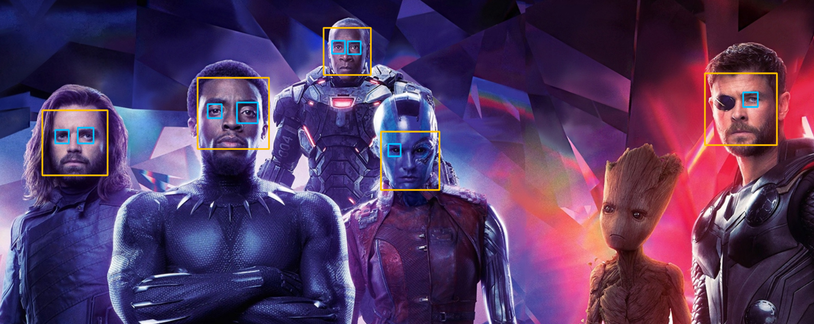

## 3.	简易的人脸识别

此案例主要参考**Github**上有**vipstone**于2018年上传的一份教程。[原文请看](https://github.com/vipstone/faceai)。可能是由于版本的缘故，在我尝试搭建的时候修复了一些bug，并做了一些扩展的补充和个人理解 ，希望有助于理解。

### 1. 图片中的人脸试别   

我们需要搭建[OpenCV](https://opencv.org/)环境。OpenCV是一个跨平台的图像处理和计算机视觉的方法库。它为Python，Matlab，C++等语言都提供了接口。我们可以利用这些已经早好的轮子来实现人脸识别。  
由于OpenCV 引用了numpy的方法，因此我们首先需要先安装numpy模块。numpy模块主要是用来支持处理多维度的数组或矩阵的数学函数库。   
+ numpy [官方下载地址](https://pypi.python.org/pypi/numpy)，或可直接在terminal中执行```pip install numpy```
+ OpenCV **.whl** 包[下载地址](https://www.lfd.uci.edu/~gohlke/pythonlibs/#opencv)。**.whl** 包可以通过pip在安装。在terminal中执行```pip3 install XXX\opencv_python-3.4.1-cp36-cp36m-win_amd64.whl```
+ 我们可以在一个空白 **.py** 文件中导入 **numpy** 和 **cv2** ，通过查看版本来测试一下是否安装成功。

    ```
    import numpy
    import cv2

    print(numpy.__version__)
    print(cv2.__version__)

    ```

#### 1.1. 图片人脸检测

1. 首先我们可以导入一张图片置灰，来降低计算的强度
2. 使用openCv中的CascadeClassifier来定位人脸
3. 我们用一个正方形形来框出人脸的范围

首先我们来认识一下**CascadeClassifier**[官方文档](https://docs.opencv.org/2.4/modules/objdetect/doc/cascade_classification.html?highlight=cascadeclassifier#cascadeclassifier)中介绍了CascadeClassifier的由来和模型的基本原理。我们使用 ```cv2.CascadeClassifier``` 的方法官方介绍是 **检测输入图像中不同形状的物体，被检测到的物体会以一个举行列表的形式来返回** 这里的物体只的是引入模型所能试别的物体，如眼睛，脸，半身，全身等。  

公式：```cv2.CascadeClassifier.detectMultiScale(image, scaleFactor, minNeighbors, flags, minSize, maxSize)```

+ image 一般为灰色gary，加快处理速率
+ objects 包括被检测的物体的矩形的向量
+ scaleFactor 图像缩放比例
+ minNeighbors 构成检测目标的相邻矩形的最小个数，默认为3.  
（如果组成检测目标的小矩形的个数和小于 min_neighbors - 1 都会被排除。如果min_neighbors 为 0, 则函数不做任何操作就返回所有的被检候选矩形框，这种设定值一般用在用户自定义对检测结果的组合程序上。[出自](https://blog.csdn.net/itismelzp/article/details/50379359)）
+ flags 要么使用默认值，要么使用CV_HAAR_DO_CANNY_PRUNING，如果设置为CV_HAAR_DO_CANNY_PRUNING，那么函数将会使用Canny边缘检测来排除边缘过多或过少的区域，因此这些区域通常不会是人脸所在区域 [出自](https://blog.csdn.net/itismelzp/article/details/50379359)
+ minSize 被检测对象最小大小
+ maxSize 被检测对象最大大小

首先我们可以尝试一个框出人脸基本特征的例子

    ```
    import cv2

    filepath = "test2.jpg"
    img = cv2.imread(filepath)  # 读取图片
    gray = cv2.cvtColor(img, cv2.COLOR_BGR2GRAY)  # 转换灰色

    # OpenCV人脸识别分类器 括号中内容为识别器脚本的地址
    faceClassifier = cv2.CascadeClassifier(
        r"./openCv/opencv/data/haarcascades/haarcascade_frontalface_default.xml"
    )

    eyesClassifier = cv2.CascadeClassifier(
        r"./openCv/opencv/data/haarcascades/haarcascade_eye.xml"
    )

    colorSet = [(0, 191, 255), (255, 191, 0)] # 定义矩形颜色 - DeepSkyBlue1
    # 调用openCv人脸试别模块
    faceRects = faceClassifier.detectMultiScale(
        gray, scaleFactor=1.2, minNeighbors=3, minSize=(32, 32))

    eyesRects = eyesClassifier.detectMultiScale(
        gray, scaleFactor=1.2, minNeighbors=3, minSize=(10, 10))

    if len(faceRects) and len(eyesRects):  # 大于0
        for faceRect in faceRects:  # 框出每一张人脸
            x, y, w, h = faceRect
            # 框出人脸
            cv2.rectangle(img, (x, y), (x + h, y + w), colorSet[0], 2)

        for eyesRect in eyesRects:  # 框出每一只眼睛
            x, y, w, h = eyesRect
            # 框出眼睛
            cv2.rectangle(img, (x, y), (x + h, y + w), colorSet[1], 2)

    cv2.imshow("image", img)  # 显示图像

    cv2.waitKey(0)
    cv2.destroyAllWindows()

    ```

我们通过不断的修改参数来配合要检测图片的大小，最终会得到一个比较完美的结果。

</img>

在这个案例中我们使用了两个classifier，一个是正脸的，一个是裸眼的。其他的模型我们可以在**haarcascade**文件夹下来获得。

返回的**x**和**y** 代表着矩形其实点也就是左上角顶点的坐标。同样，坐标原点是从窗口的左上角算起的。**w**和**h**代表矩形的宽和高。

```cv2.rectangle(img, (x, y), (x + h, y + w), colorSet[0], 2)```
这句话表示，我们要在**img**这个画布画一个是从 **(x, y)** 起始向延展的到坐标为 **(x+h, y+w)** 的矩形，他的颜色是 **colorSet**中的第一个元素，线条粗细为**2**。

waitKey()与waitKey(0)代表窗口无线等待，直到有按键按下。waitKey(n) 中的n标识毫秒数，暨窗口展示的时间。如果你把它放到一个循环中去读。视频，它将显示视频帧逐帧。

```cv2.destroyAllWindows()``` 表示关闭所有窗口，释放内存。

我们可以通过一些简单的判断条件来对眼部的方框和脸部方框进行关联，从而在即使把眼部的minSize()设置的很小的情下况也不框出太多的错误方框。比如，我们可以限制眼部方框的坐标要在脸部方框之内。[可参见]("./imgFaceDetect.py")

#### 1.2 视频人脸检测

视频人脸检测和图片人脸检测的原理一致，我们只需要把视频中每一帧或几帧中选择一帧进行图片人脸检测，再展示出来，即可达到视频人脸检测的效果了。
+ 首先我们先利用上个例子中的代码做出人脸检测的方法```detectFace()```
+ 我们可以利用 **openCV** 中的 **VideoCapture()** 模块来获取电脑摄像头的图像 ```videoCapture()```括号中的数字表示要使用哪个计算机摄像头，只有一个摄像头时为```videoCapture(0)``` 同样括号中我们也可以添加视频的路径，这样**videoCapture**就会去读取此视频。关于videoCapture的更多配置和方法[可参考](https://docs.opencv.org/4.0.0/d8/dfe/classcv_1_1VideoCapture.html#a57c0e81e83e60f36c83027dc2a188e80)

+ 我们可以利用一个while循环来不间断的读取摄像头返回的视频 -> 使用 ```detectFace()``` -> 展示图片。
+ 在调试的过程中，我发现在物体运动的过程中，识别经常会抛出异常，那么我们为了能够顺利识别出运动的人脸，可以在抛出这种异常时不阻断程序运行。
+ 我们可以设置一个判断条件来作为程序的开关。当达到此条件时，程序关闭。例子中时以按下“q”键为关闭信号的。
+ 在程序完全结束之前我们一定不要忘记关闭摄像头，并且释放资源

    ```
    # coding=utf-8

    import cv2
    faceClassifier = cv2.CascadeClassifier(
        r"./openCv/opencv/data/haarcascades/haarcascade_frontalface_default.xml")
    eyesClassifier = cv2.CascadeClassifier(
        r"./openCv/opencv/data/haarcascades/haarcascade_eye_tree_eyeglasses.xml"
    )

    colorSet = [(0, 191, 255), (255, 191, 0)]  # 定义矩形颜色 - DeepSkyBlue1


    def detectFace(img):
        gray = cv2.cvtColor(img, cv2.COLOR_BGR2GRAY)
        faceRects = faceClassifier.detectMultiScale(
            gray, scaleFactor=1.2, minNeighbors=3, minSize=(80, 80))

        eyesRects = eyesClassifier.detectMultiScale(
            gray, scaleFactor=1.1, minNeighbors=3, minSize=(15, 15))

        for faceRect in faceRects:  # 框出每一张人脸
            x, y, w, h = faceRect
            # 框出人脸
            cv2.rectangle(img, (x, y), (x + h, y + w), colorSet[0], 2)

        for eyesRect in eyesRects:  # 框出每一只眼睛
            x, y, w, h = eyesRect
            # 框出眼睛
            cv2.rectangle(img, (x, y), (x + h, y + w), colorSet[1], 2) 
        cv2.imshow("Image", img)


    cap = cv2.VideoCapture(0)
    while (1):  # 逐帧显示
        ret, img = cap.read()
        try:
            detectFace(img)
        except BaseException:
            continue
        if cv2.waitKey(1) & 0xFF == ord('q'):
            break
    cap.release()  # 释放摄像头
    cv2.destroyAllWindows()  # 释放窗口资源
    ```


我们在看openCV 的材料时会经常看到```cv2.waitKey(1) & 0xFF == ord('q')```这样的写法来获取用户按键操作的。其意思为：**0xff** 是一个16进制的数，转换成二进制就 **1111 1111** 占八个位，这样和waitKey()进行与运算后，就将其八位之前的所有数都变成了0。**ord('q')**是q转换成ASCII码值，和刚刚算出来的后八位进行比较。因此我们可以获得用户的按键信息从而控制。

---

```
# coding=utf-8
# 性别识别

import cv2
from keras.models import load_model
import numpy as np
face_classifier = cv2.CascadeClassifier(
    r"./openCv/opencv/data/haarcascades/haarcascade_frontalface_default.xml")
gender_classifier = load_model("genderModel.hdf5")


def discern(img):
    # img = cv2.imread("test2.jpg")
    gray = cv2.cvtColor(img, cv2.COLOR_BGR2GRAY)
    faces = face_classifier.detectMultiScale(gray,
                                             scaleFactor=1.2,
                                             minNeighbors=3,
                                             minSize=(70, 70))
    gender_labels = {0: 'Female', 1: 'Male'}
    color = (115, 233, 86)

    for (x, y, w, h) in faces:
        face = img[(y - 60):(y + h + 60), (x - 30):(x + w + 30)]
        face = cv2.resize(face, (48, 48))
        face = np.expand_dims(face, 0)
        face = face / 255.0
        gender_label_arg = np.argmax(gender_classifier.predict(face))
        gender = gender_labels[gender_label_arg]
        cv2.rectangle(img, (x, y), (x + h, y + w), color, 2)
        cv2.putText(img, gender, (x, y + 1), cv2.FONT_HERSHEY_SIMPLEX, 0.7,
                    color, 2)
    cv2.imshow("Image", img)


cap = cv2.VideoCapture(0)
while (1):  # 逐帧显示
    ret, img = cap.read()
    # cv2.imshow("Image", img)
    try:
        discern(img)
    except BaseException:
        continue
    if cv2.waitKey(1) & 0xFF == ord('q'):
        break
cap.release()  # 释放摄像头
cv2.destroyAllWindows()  # 释放窗口资源

```

---
[上一章](./chapter2.md)-----[主页](../README.md) ----- [下一章](./chapter4.md)