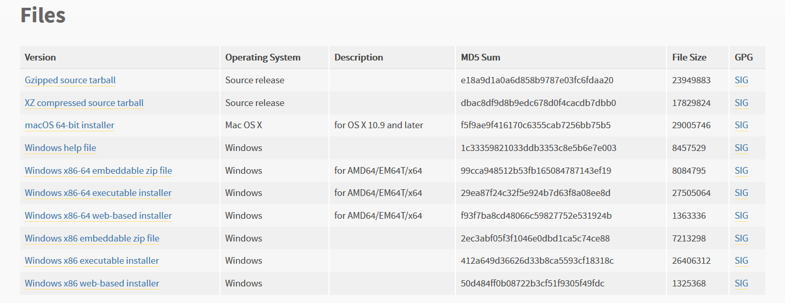
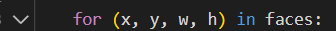

 
# Python 从0开始
## 0. 前言
这个心得目的在于让完全没有接触过编程的同学快速运用Python，其中加入了很多粗浅的解释和模糊的描述，旨在让没有完全编程基础的同学快速理解，省略了很多底层解析。同时会有一些不恰当的比喻，为了增加记忆点，简化过程直奔主题。作者也是完全从0开始自学，一些不恰当的理解在所难免。为了避免误人子弟，还是要参考Python[官方文档](https://docs.python.org/3/)进行学习。有任何错误的解释，欢迎提出pull request。

其中中涉及到的例子都是经过实践的，可直接复制，也可git拉取运行。关于Git和Markdown的使用方法，后期会进行整理。

**撰写过程中参考许多国内外论坛，如有侵权，请及时指出！**

## 1.	Windows + Python 3 + VS Code 环境搭建
### 1.1.	Python 3 环境搭建
Python 是一种解释型、面向对象、动态数据类型的高级程序设计语言。Python 由 Guido van Rossum 于 1989 年底发明，第一个公开发行版发行于 1991 年。像 Perl 语言一样, Python 源代码同样遵循 GPL(GNU General Public License) 协议。官方宣布，2020 年 1 月 1 日， 停止 Python 2 的更新。Python 2.7 被确定为最后一个 Python 2.x 版本。因此此教程只会讲述Python 3.0+ 的相关应用。

首先登陆[Python官网](https://www.python.org/)， 导航栏下Download 模块中显示最新发布的python稳定的版本，本文使用的时Python 3.8.0

</img>

点击超链接进入版本详情界面，可以看到版本的简介，和上一版本比较，新功能，对windows 和macOs用户的安装环境的要求，和下载文件列表。

</img>
 
Python可应用于多平台包括 Linux 和 Mac OS X。官网提供了不同操作系统下多种安装包，可以通过安装器installer安装，也可以直接下载压缩包安装。Unix & Linux 平台安装和其他[安装细节](https://www.runoob.com/python/python-install.html)可参考菜鸟。
### 1.2.	Windows环境变量的配置
程序和可执行文件可以在许多目录，而这些路径很可能不在操作系统提供可执行文件的搜索路径中。path(路径)存储在环境变量中，这是由操作系统维护的一个命名的字符串。这些变量包含可用的命令行解释器和其他程序的信息。可以简单的理解为使用一个变量来保存python执行文件的路径，在任何地方使用命令行解析器（CMD）都可以调用python的命令。
#### 1.2.1.	 命令行添加
打开“命令提示符”，搜索“cmd”即可看到。 

</img>

输入
```
path=%path%;C:\XXX\XXX\Python
```
此路径为Python在本地的安装路径
#### 1.2.2.	控制面板添加
在windows 中搜索“**编辑系统环境变量**”，进入控制面板。

</img>

点击“环境变量”按钮，进入环境变量编辑页。

 </img>

可以在定义环境变量问用户变量或者系统变量中的Path变量，区别在于用户变量指对计算机当前用户有效，系统变量可以被任何本机用户适用。

  </img>

如果没有Path，可以点击“**新建**”添加一个。
双击Path或选中后点击“**编辑**”，即可打开“**编辑环境变量**”。在新的一行添加Python的文件路径，系统环境变量都在一行编辑，需要用英文分号与其他路径隔开。

  </img>

添加后可以打开CMD验证，在任意文件位置输入 ```python``` 回车，即可显示Python的版本号和基本提示。如果显示类似信息可以认为我们已经成功安装了Python 3。Congratulations!

  </img>

我们可以在Cmd 中执行简单的Python脚本，但是强大的编辑器会是我们轻松的进行复杂编辑，使用一些框架，进行调试等等。因此我选用了Visual Studio Code 这一较轻量级的编辑器来进行代码编辑。最主要的优点就是VS code有良好的开发团队，不断的在增加对不同语言的支持,尤其是较新的语言。同时插件非常丰富，编译速度也很快。
## 1.3 Visual Studio Code
[VS Code官网](https://code.visualstudio.com/)下载稳定版编辑器

<table width="500">
  <tr>
    <td>
      </img>
    </td>
    <td>
      </img>
    </td>
  </tr>
</table>

安装完成后，打开VS code， 点击左侧导航栏图标，或使用快捷键 ```Ctrl + Shift + X``` 打开插件（Extensions）管理插件。
在搜索框中输入Python，选择Python 插件，安装并启用。

  </img>

其他建议安装插件：
+ **Beautify**
+ **Bracket Pair Colorizer**
+ **Git History**
+ **Visual Studio IntelliCode**

首先，创建一个空文件夹，然后使用VS Code打开它。通过VS Code打开文件夹，该文件夹就变成了你的”工作区“。VS Code在```.vscode/settings.json```中存储该工作去的特殊配置，与用户的全局设定相分开。因此要单独给VS Code配置Python的环境变量，以便在VS Code自带的terminal中输入环境变量快速启动Python程序。

在文件夹中创建一个新文件，例如：main.py作为程序主文件。使用 ```Ctrl + Shift + P``` 打开顶部命令板， 输入 ```Python: Select Interpreter``` 并回车或选择，接下来所有的Python解析器会展示在列表中，我选择了最原始的**Python 3.7.2 64-bit**

</img>

也可以在，打开 **文件->首选项->设置**， 搜索```python.pythonPath```，输入Python的地址到Python Path下的输入框，既可以指定编译器使用你已经下载的Python 3.x
 
</img>

</img>

 
也可以通过打开文件夹.vscode中的**setting.json**直接配置，注这种方式地址中需要对```\```进行转义，暨```\\```即可。
 
 </img>

配置结束，打开终端中，新的终端。终端便于我们直接执行命令行，查看代码编译问题，查看debug的控制台，直接看到输出结果等。对于配置细节可参考[VS Code 官网](https://code.visualstudio.com/docs/python/environments) 
 
 </img>

切换到终端Terminal， 输入```python``` 回车， 即可看到和CMD 中相同的效果，暨VS code的环境变量配置成功，Congratulations!

 </img>

在一次编辑中，暨打开一VS code工程，terminal 可以反复利用。
+ **New Terminal** - 快速打开多个terminal，方便启功多个脚本
+ **Kill terminal** - 垃圾桶图标 关闭当前terminal
+ **选择器** - 对terminal的切换
+ **Split terminal** – 同一窗口打开多个terminal
+ **Maximize/Restore Peniel Size** - 全屏或小窗口terminal

---
## 2.	Hello World！
### 2.1. Python 初体验 Hello World！ 
在文件main.py上输入代码
```
print('Hello World!')

```
注意程序最后一行为空白行，否则会会提示编译警告。
在terminal中输入```python main.py``` 回车，则开始运行主程序。
 
  </img>

可以看到下面一行，打印出Hello World! 
Congratulation!我们已经成功运行了第一个Python程序。
同样，我们也可以利用debug模式运行程序，以方便我们设置断点进行调试（debug模式的使用将在后面章节详细说明）
点击左侧瓢虫图标或者 ```Ctrl + Shift + D``` 打开Debug控制台。点击**Start Debugging** 绿色三角按钮开始启动程序。

  </img>

 同样在经过编译后 terminal中会打印 ```Hello World!``` 字样。
### 2.1. Python 语法
#### 2.1.1. Python 基础语法要点
1. 标识符
    + 以下划线开头 如 ```_function```，不能直接访问，不能 ```from xxx import _function```导入，需要通过接口访问
    + 以双下划线开头和结尾 如 ```__init__()```为特殊方法专用
    + 保留字符 - 不能作为变量或者常数使用，运行以下代码查看
      ```
      import keyword
      print(keyword.kwlist)

      ```
2. 缩进和空格

    Python是缩进式区分模块的语言，类似于Dart语言。优点是我们可以很清晰的看出每块代码的结构，缺点是不容易找出缩进引起的错误。
  VS Code 可以自动检测每块代码，可以通过点击序列前的箭头按钮来收起和展开一块代码 

    </img>

    Python 对空格的要求十分严格，空格和TAB不能混用，若混用编译后会报错```IndentationError: unindent does not match any outer indentation level```, 统一每一行前的空格为一种形式即可，VS Code中一般4个空格，或2个TAB 视为一次缩进。由于默认代码检查插件的缘故，即时修改VS Code设置，不以2TAB缩进，也会出现警告提示。

3. 符号，输入，输出
    + \# - 用于注释代码，暨解释说明，无意义 ```# This is my first python app! ``` 
    + ' 或 " - 标识字符串内容，暨引号内内容为一段文字 ```pie = 'A normal pie'```
    + ''' 或 """ - 用于多行注释 
      ```
      ''' 
      this is the first line
      this is the second line
      '''
      ```
      同时 ''' 也可以标识多行字符串的内容，
      ```
      print(
        '''Hello
        World!'''
      )
      ```
      运行可看到terminal中打印
      ```
      Hello
      World!
      ```
    + input - 用户输入
      ```
      myInput = input("按下 enter 键退出，其他任意内容显示\n")
      print(myInput)
      ```
      暨定义一个变量```myInput```等于我们要输入的值，再把刚刚输入的值打印出来。```\n```代表换行。
    + print - 打印 在print中加入参数```end```为空字符，暨两次print不换行
      ```
      print('May I have ', end='')
      print('a cup of tea, ', end='')
      print('please!')
      ```
      暨打印出
      ```
      May I have a cup of tea, please!
      ```
    + : - 代码组的一部分，标识下面缩进内容属于该方法
      ```
      me = 'hungry'
      if me == 'hungry':
          print('Eat a pie!')
      ```
      print的内容属于```if```这个块内的代码，只有当```me```等于```'hungry'```时触发。
#### 2.1.2. Python 浅尝
1. import 和 from import  
  我们在写代码的过程中，有时候需要用到多种类型的文件和脚本。我们不可能把全部内容放到同一个文件中。想要调用其他文件中内容，我们可以运用```import``` 和 ```from xxx import xxx```

    + import A  - 导入整个模块A
    + from B import A - 导入 B 模块中的 A 方法
    + from B import A, C, D - 导入 B 模块中 A, C, D 三个方法
    ```
    from sys import argv
    print(argv)
    ```
    ```
    import sys
    print(sys.argv)
    ```
    两个例子效果相同，此处我们引用了系统模块中的一个方法叫argv（argv可以理解为python脚本的输入参数列表）
2. 变量和赋值  
    + 变量 - 可以变化的量，除保留字符外任意命名。对大小写敏感暨区分大小写。一般遵守驼峰式命名。如```myPhone、applePie、 johnSmith```
    + = - 赋值暨等号右侧的值赋给左侧变量
    ```
    dinner = 'chicken fried rice'
    # dinner变量是一个叫 chicken fried rice的字符串

    breakfast = lunch = dinner = 'banana'
    # 变量breakfast和lunch和dinner 都等于 字符串 apple
    
    breakfast, lunch, dinner = 'pizza', 'double cheese hamburger', 'big mac'
    # 变量breakfast等于pizza，lunch等于double cheese hamburger，dinner等于big mac
    ```
3. 标准数据类型  
    + Number（数字）包括 int(整数)、float(小数)、bool(True或False)、complex(复数)四种类型
      ```
      num = 4+3j
      print(type(num))
      # 打印num的类型

      print(isinstance(num, complex))
      # 打印判断num是不是complex类型的结果
      # type()不会认为子类是一种父类类型
      # isinstance()会认为子类是一种父类类型（父子类的概念在后面章节会讲解）
      ```
      得到
      ```
      <class 'complex'>
      True
      ```
      True的值为1，False的值为0，在python中True/False可以直接与数字进行运算

    + String（字符串）
      可以理解为一段文字，用 **'** 或 **"** 包裹。  
      运算符：
      符号 |  描述  
        -|-
        \+ | 拼接
        \* | 复制
        \ | 转义
      ```
      print(('\nHello' + '\n' + 'World!') * 2)
      ```
      得到
      ```
      
      Hello
      World!
      Hello
      World!
      ```

      如果不想转义 在字符串前加 **r** 即可

      ```
      print('first line\n second line')
      #\n 为换行符号
      
      print(r'first line\n second line')
      # \n 为字符串
      ```
      得到
      ```
      first line
       second line
      first line\n second line
      ```
      截取字符串：python中的位置索引是从0开始的，一个字符串的首字母暨在第0位上，截取写法例如：
      ```
      index = 'abcdefg'
      print(index[0:-1])    #  第一个到倒数第二个个字符 abcdef
      print(index[0])       #  第一个字符 a
      print(index[2:5])     #  第三个到第五个的字符 cde
      print(index[2:])      #  第三个后所有字符 cdefg
      ```
      Python中字符串不能被改变，因此```word[0] = 'm'```这种写法是错误的，可以对变量重新赋值来进行更改。
    + List（列表）
      顾名思义，一维列表可以想象成一行数据的有序集合，用 **[]** 包裹，如```list = [abc, 123, 'abc', True]```。列表中每个元素可以是任意类型数据，且有位置索引（从0开始）。```list[0]```标识list中第一位的元素，是一个叫```abc```的变量。同理```list[2]```是一个字符串，它的值是```abc```。  
      由于列表中可以嵌套列表，因此列表可以是多维的，如```list = [[1, 2, 3], [4, 5, 6], [7, 8, 9]]```表示的是一个二维列表
        ||||
        -|-|-
        1|2|3
        4|5|6
        7|8|9
      那么```list[1][1]```就是```5```。同样列表也可以用```+``` 和```*```进行运算，原理和字符串相似，结果是一个较高维度的新数组
      ```
      list = [1, 1, 1]
      list2 = [[2.1, 2.1, 2.1], [2.2, 2.2, 2.2]]
      print(list + list2)
      # 得到 [1, 1, 1, [2.1, 2.1, 2.1], [2.2, 2.2, 2.2]]
      ```
      列表的截取方式和字符串相同，不同的是，列表中元素可以被替换，如:
      ```
      list = ['Tim', 'Will', 'Lee']
      list[1] = 'John'
      print(list)

      #得到:['Tim', 'John', 'Lee']
      ```
    + Tuple（元组）
      与列表类似，区别是元组中的元素不可修改，用 **()**包裹
    + Set（集合）  
      集合（set）是由一个或数个形态各异的大小整体组成的，构成集合的事物或对象称作元素。用 **{}** 包裹。注意，在创建空集合是需要使用 ```set()```, 而不是 ```{}```。与数学上的集合相似，集合中元素是无序且会自动去重，其运算方式也是符合数学逻辑的。
      ```
      ageSet = {28, 26, 28, 27, 32, 33, 26}
      print(ageSet)

      # 得到 {32, 33, 26, 27, 28}
      ```
      运算符：
      符号 |  描述  
        -|-
        \- | 差集
        \| | 并集
        & | 交际
        ^ | 非交集
      ```
      ageSet1 = {28, 26, 28, 27, 32, 33, 26}
      ageSet2 = {25, 26, 24, 30, 33, 29, 28}
      print(ageSet1 - ageSet2)   # {32, 27}
      print(ageSet1 | ageSet2)   # {32, 33, 24, 25, 26, 27, 28, 29, 30}
      print(ageSet1 & ageSet2)   # {33, 26, 28}
      print(ageSet1 ^ ageSet2)   # {32, 24, 25, 27, 29, 30}
      ```
    + Dictionary（字典）
      字典可以想象成是一种key-value形式的无序集合，用 **{}** 包裹，也可以用```dict()````定义。和现实中的字典相似，要找到一个字(value)，首先我们要知道一个拼音或者偏旁部首(key)。在一个字典中key值是唯一的，因此通过一个key就必定能找到一个value，即使是空值。
      ```
      foodMenu = {
          'appetiser': ['salad', 'bread', 'butter'],
          'mainCourse': ['lambShank'],
          'desert': 'teaCake'
          }
      print(foodMenu['mainCourse'])  #  ['lambShank']
      print(foodMenu.values())  #  dict_values([['salad', 'bread', 'oliver'], ['lambShank'], 'teaCake'])
      ```
      和列表相似，字典也可以进行嵌套。为字典增加一个新key可以直接写为```foodMenu['drink'] = 'houseAle'```。同时字典具备 clear(), keys(), values()这样的内置函数。  
4. 数据转换  
    参考[菜鸟教程](https://www.runoob.com/python3/python3-data-type.html)   
    常用方法：
    |||
    -|-
    int(x, base=y) 或 int(x) | 转换成整数。```base=y``` 为该数字为y进制 base有值时 x必须为字符串；base无值时 x 为数字。因此要把16进制的18.2转换成10进制整数```int(str(int(18.2)), base=16)```
    float(x) | 转换成小数
    str(x) | 转换成字符串
    repr(x) | 转换对象成字符串
    eval(x) | 转换字符串成对象
5. 运算符号
  + 运算符
      符号 |  描述  
      -|-
      \+ | 加
      \- | 减
      \* | 乘
      / | 除
      // | 除，取整, 不四舍五入，除小数后返回**整数.0**如```100//11.1 = 9.0```
      % | 取余数
      ** | 乘方
      & | 且 (二进制)
      \| | 或 (二进制)
      ^ | 按位异或 (二进制)
      ~ | 按位取反 (二进制)
      << | 按位左移 (二进制)
      \>> | 按位右移 (二进制)
  + 比较符
      符号 |  描述  
      -|-
      == | 等于
      != | 不等于
      \> | 大于
      < | 小于
      <= | 小于等于
      \>= | 大于等于
  + 赋值运算符
    符号 |  描述  
      -|-
      = | 赋值
      += | ```a += b``` 相当于 ```a = a + b```
      -= | ```a -= b``` 相当于 ```a = a - b```
      *= | ```a *= b``` 相当于 ```a = a * b```
      /= | ```a /= b``` 相当于 ```a = a / b```
      %= | ```a %= b``` 相当于 ```a = a % b```
      **= | ```a **= b``` 相当于 ```a = a ** b```
      //= | ```a //= b``` 相当于 ```a = a // b```
  + 逻辑运算符
    符号 |  描述  
      -|-
      and | 与
      or | 或
      not | 非
  + 身份运算符
      符号 |  描述  
      -|-
      is | 同内存地址
      is not | 不同内存地址
      ```
      john = 'man'
      tim = 'woman'[2:]
      print(john is tim)        #  False

      will = 'man'
      print(john is will)       #  True
      ```
  + 身份运算符   
  
      |符号 |描述|  
      |---------|---------|
      |in | 非|
      |not in | 非|

      ```
      john = 'man'
      ada = 'woman'
      print(john in ada)         #  True

      gender = ['man', 'woman', 'LGBT', 'cant tell']
      print(john in gender)      #  True
      ```
#### 2.1.3. Python 基础语句
1. 判断
2. 循环
3. 迭代与生成
4. 函数
5. 数据结构
6. 模块
7. 输入与输出
#### 2.1.4. Python 中级语句
1. 文件
2. 类
3. 标准库
4. 错误与异常
---
## 3.	简易的人脸识别
---

# 未完待续！！！！
